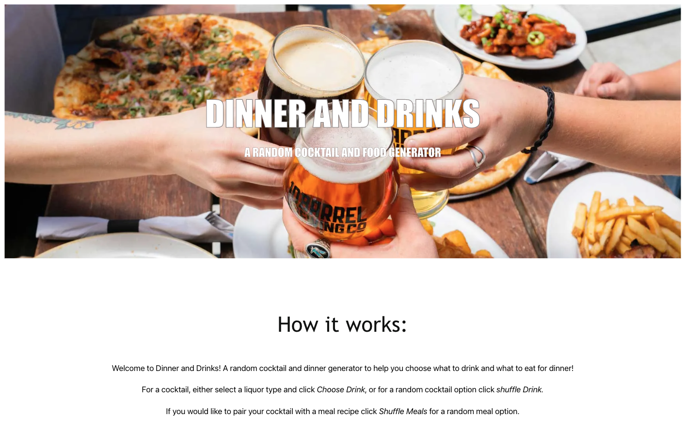
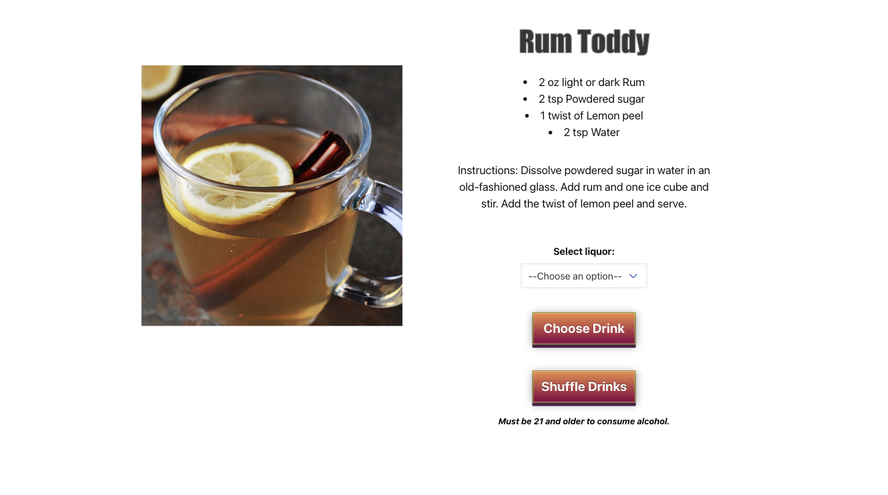
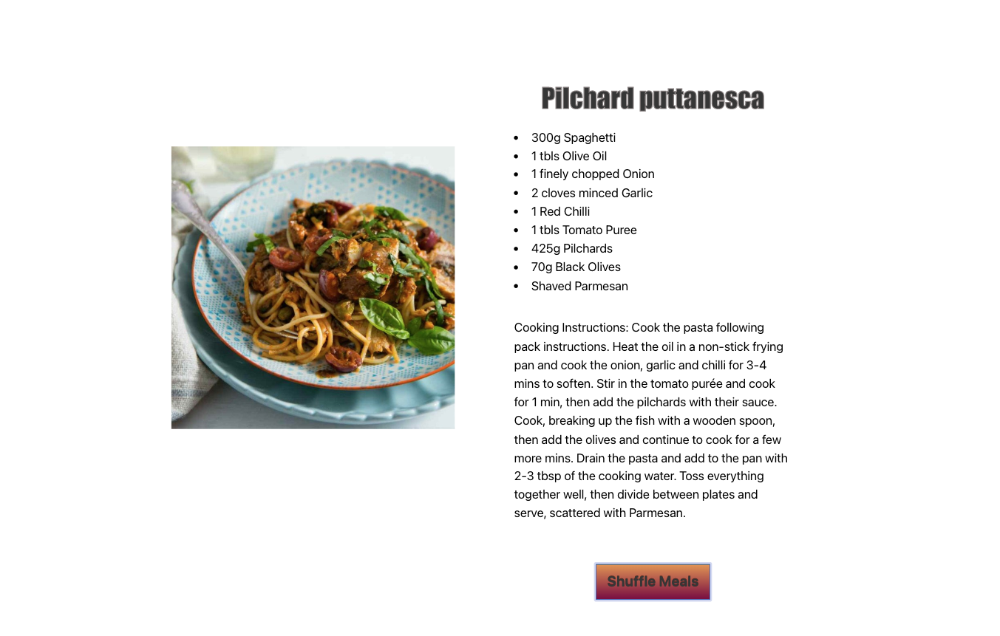

# Dinner and Drinks Application

## Description

Motivation for the Dinner and Drinks was simple, create an easy to use food and drink app that inspires users with new recipes and easy to choose options. A one-click shuffle button provides the user with a random drink or food recipe. If they want a specific kind of drink, the user can pick a liquor type from the drop-down value and click choose a drink. The generator will provide them with a drink based on what type of alcohol they select.

The main problem we wanted to solve was to give people more choices when making drinks or food. Instead of the same boring beverages and recipes, we wanted to provide the user with various options. That way, they can try new drinks and dishes enjoyed by themselves or with family and friends.

## Installation & Usage

To use Dinner and Drinks app visit https://rachelwildberger.github.io/super-awesome-app/, and read <em>How it Works</em>, if you want to choose your liquor type, click from the drop-down and click <em>Choose Drink</em>, if you want a random surprise cocktail click <em>Shuffle Drinks</em> for a random option.   

## Technologies Used 

https://www.themealdb.com/

https://www.thecocktaildb.com/

https://github.com/BulmaTemplates/bulma-templates/blob/master/templates/register.html

## Credits

Collaborators:

Rachel Wildberger 
https://github.com/RachelWildberger

Hollie Sundra 
https://github.com/HollieSundra

Davey Melero
https://github.com/DaveyMelero

Nikhil Prince
https://github.com/NikhilPrince

If you used any third-party assets that require attribution, list the creators with links to their primary web presence in this section.

If you followed tutorials, include links to those here as well.

